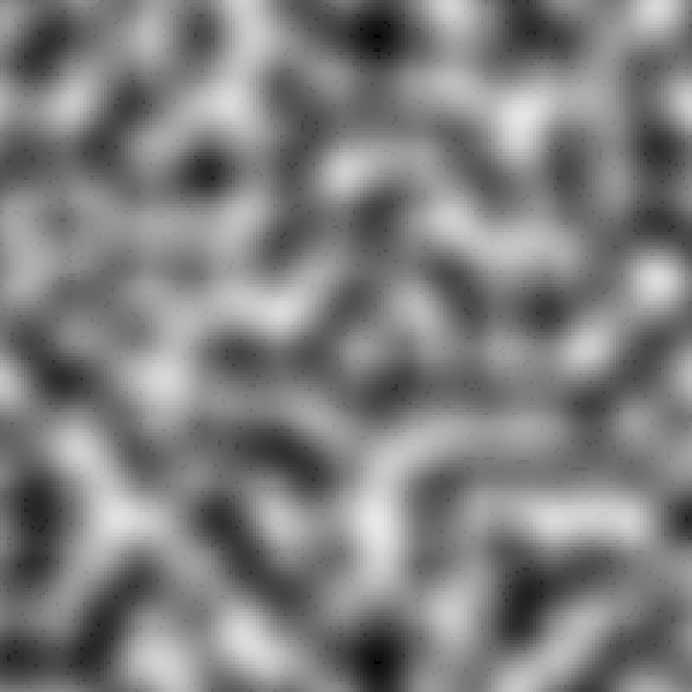

# PerlinNoise

: Just a perlin-noise simulator     
     
Try generate yours (black & white / minecraft) @ https://lxxjs.github.io/PerlinNoise/

| Black & White | Minecraft Map|
| ---------------------------------------------------------------------------------------------------------------------------|---------------------------------------------------------------------------------------------------------------------------------------------|
| ||

